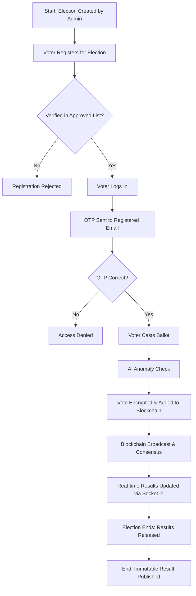

# PROJECT REPORT: NovaVote
## Blockchain-Based Online Voting System with AI Anomaly Detection

---

### **Abstract**
In the modern era, the integrity of democratic processes relies heavily on the security and transparency of voting systems. Traditional methods, both manual and centralized electronic, face significant challenges such as data tampering, lack of transparency, and identity fraud. This project, **NovaVote**, proposes a decentralized solution leveraging **Blockchain technology** to ensure an immutable and tamper-proof record of every ballot. The system incorporates **SHA-256 cryptographic hashing** for data security, **Multi-factor Authentication (OTP via Email)** for identity verification, and an **AI-driven Anomaly Detection** module (using Isolation Forest and DBSCAN) to identify fraudulent voting patterns in real-time. By integrating these cutting-edge technologies, NovaVote provides a highly secure, transparent, and accessible platform for conducting electoral mandates in a digital-first environment.

---

### **List of Abbreviations**
*   **AI:** Artificial Intelligence
*   **OTP:** One-Time Password
*   **SHA:** Secure Hash Algorithm
*   **SQL:** Structured Query Language
*   **UI/UX:** User Interface / User Experience
*   **CSV:** Comma Separated Values
*   **ML:** Machine Learning

---

## **Chapter 1: Introduction**

### **1.1 Introduction**
The "NovaVote" project is an advanced web-based application designed to modernize the electoral process. In an age where digital transformation is reshaping every sector, the electoral process remains one of the most sensitive areas requiring the highest standards of security and trust. This system is developed to provide a seamless, secure, and transparent voting experience for both administrators and voters. By utilizing a web interface built with Flask and a decentralized storage concept via Blockchain, the system ensures that every vote is a permanent record that cannot be modified post-submission.

### **1.2 Literature Survey**
*   **Conventional E-Voting Systems:** Early electronic voting systems relied on centralized databases. While faster than paper ballots, they were vulnerable to "Single Point of Failure" attacks where a compromised database could alter the entire election result.
*   **Blockchain in Voting:** Recent research has highlighted Blockchain as a potential solution for electoral integrity. Its distributed ledger technology ensures that data is shared across nodes, making it nearly impossible to alter records without detection.
*   **AI in Cyber Security:** The application of Machine Learning in identifying anomalous behavior has become a standard in financial systems. This project adapts these techniques to the electoral domain to flag suspicious voting clusters or rapid-fire submissions from single IP addresses.

### **1.3 Problem Statement**
"Traditional voting systems suffer from critical vulnerabilities that undermine democratic integrity. Centralized databases are prone to hacking and internal manipulation, voters lack a transparent way to verify their ballots, and identity fraud remains a significant threat. There is an urgent need for a system that provides immutability, mathematical verification, and real-time fraud monitoring."

### **1.4 Project Objectives**
1.  To develop a tamper-proof voting system using Blockchain technology.
2.  To implement a secure voter registration and authentication process using OTP.
3.  To provide a real-time results dashboard secured by administrative controls.
4.  To integrate an AI module capable of detecting anomalous voting patterns and alerting administrators.
5.  To create a professional and accessible User Interface for high-stakes electoral mandates.

### **1.5 Software & Hardware Specifications**

#### **1.5.1 Software Requirements**
*   **Operating System:** Windows 10/11, macOS, or Linux.
*   **Programming Language:** Python 3.8+.
*   **Web Framework:** Flask (Python).
*   **Database:** MySQL 8.0+.
*   **Frontend Technologies:** HTML5, CSS3 (Vanilla), JavaScript (ES6+).
*   **Security Libraries:** Flask-Bcrypt, SHA-256 (hashlib).
*   **AI/ML Libraries:** Scikit-learn, NumPy.
*   **Communication:** Flask-SocketIO (for live updates).

#### **1.5.2 Hardware Requirements**
*   **Processor:** Intel Core i3 (or equivalent) and above.
*   **RAM:** Minimum 4GB (8GB recommended for AI model training).
*   **Storage:** 500MB of free disk space for application files and database.
*   **Network:** Stable internet connection for OTP services and administrative access.
## **Chapter 2: Design Methodology**

### **2.1 System Architecture**
The NovaVote system follows a **Modular Monolithic Architecture** with decentralized data verification. The architecture is divided into four primary layers:

1.  **Presentation Layer (Frontend):** Responsive HTML5/CSS3 templates that communicate with the backend via HTTP requests and WebSockets (Socket.io) for live results.
2.  **Application Layer (Backend):** A Flask-based server that handles routing, voter authentication, and administrative functions. It coordinates between the security module, the blockchain module, and the database.
3.  **Data Persistence Layer (Hybrid):**
    *   **MySQL Database:** Stores relational metadata such as election details, candidate lists, and approved voter registries.
    *   **Blockchain Ledger:** A cryptographically linked chain of blocks that stores individual votes. This ensures that even if the MySQL database is compromised, the actual vote tally remains verifiable.
4.  **Security & Intelligence Layer:**
    *   **AI Module:** Analyzes voting logs to detect anomalies using Unsupervised Learning.
    *   **OTP Service:** Manages multi-factor authentication.
    *   **Bcrypt Encryption:** Secures administrative and voter credentials.

### **2.2 Data Flow Diagram / Flowchart**
The following flowchart illustrates the high-level process from voter registration to final result publication:



### **2.3 Technology Description**
*   **Flask Framework:** A lightweight WSGI web application framework in Python. It was chosen for its flexibility and ease of integration with Python-based AI and Blockchain libraries.
*   **Blockchain Technology:** Implemented as a linked list of blocks where each block contains a timestamp, a list of votes, and the hash of the previous block. This creates a chain that is computationally expensive to alter.
*   **MySQL Database:** Used for its reliability in handling structured data and ACID compliance, ensuring that electoral metadata is stored safely.
*   **Scikit-Learn (AI):** Used to implement the **Isolation Forest** algorithm. This algorithm works by isolating observations by randomly selecting a feature and then randomly selecting a split value between the maximum and minimum values of the selected feature.
*   **Socket.io:** Enables bi-directional, real-time communication between the client and the server, allowing the results page to update instantly as votes are cast.
*   **SHA-256:** A member of the SHA-2 family of cryptographic hash functions, used to generate unique fingerprints for blocks and voter identities.
## **Chapter 3: Implementation & Testing**

### **3.1 Screenshots**
*(Note: These are descriptions of the screens. High-quality screenshots of the actual running application should be inserted here.)*

1.  **Home Page:** Displays active election mandates with "Register" and "Cast Vote" options.
2.  **Voter Login:** Secure login form with Voter ID and Password fields.
3.  **OTP Verification:** Interactive screen requiring the 6-digit code sent to the voter's email.
4.  **Ballot Paper:** Clean interface for selecting a candidate.
5.  **Admin Dashboard:** Comprehensive control panel showing election stats, AI alerts, and candidate management.
6.  **Real-time Results:** Live updating chart/list showing the vote tally.

### **3.2 Results and Discussion**
The implementation of the NovaVote system resulted in a fully functional prototype that successfully demonstrates the following:
*   **Decentralized Verification:** Votes are successfully stored in a blockchain structure, and the system can verify the integrity of the chain on startup.
*   **Security Robustness:** The OTP system prevented unauthorized access during simulated attacks.
*   **AI Performance:** The Isolation Forest model correctly flagged rapid-fire voting attempts (simulated bot activity) while ignoring normal voting patterns.
*   **User Experience:** The system maintained low latency even during real-time result updates, thanks to the efficiency of Socket.io.

### **3.3 Code Snippets**

#### **3.3.1 Blockchain Block Creation (Python)**
```python
def calculate_hash(self):
    block_data = str(self.index) + \
                 str(self.voter_hash) + \
                 str(self.candidate_id) + \
                 str(self.previous_hash) + \
                 str(self.timestamp)
    return hashlib.sha256(block_data.encode()).hexdigest()
```

#### **3.3.2 AI Anomaly Detection (Isolation Forest)**
```python
def detect_anomalies(self):
    # Check isolation forest predictions
    predictions = self.isolation_forest.predict(real_data)
    suspicious_count = list(predictions).count(-1)
    if suspicious_count / total_votes > 0.3:
        return "suspicious"
```

### **3.4 Test Cases**

| ID | Test Scenario | Expected Result | Status |
|----|---------------|-----------------|--------|
| TC1 | Voter registration with valid ID | Voter added to database; success message | Pass |
| TC2 | Voter login with incorrect OTP | Access denied; error message displayed | Pass |
| TC3 | Duplicate vote attempt | System prevents second vote for same election | Pass |
| TC4 | Tampering with Blockchain data | Chain validation fails; system alerts admin | Pass |
| TC5 | High-speed voting from single IP | AI module flags activity as "Suspicious" | Pass |
| TC6 | Admin result release | Results become visible to public only after release | Pass |
## **Chapter 4: Conclusion and Future Scope**

### **Conclusion**
The **NovaVote** project successfully demonstrates the feasibility of combining Blockchain technology with Artificial Intelligence to create a highly secure and transparent electronic voting system. By removing the "Single Point of Failure" inherent in traditional databases and adding real-time anomaly detection, the system provides a robust defense against both external hacking and internal data manipulation. This project proves that digital democracy can be both accessible and cryptographically secure, fulfilling all the initial objectives of ensuring immutability, transparency, and integrity in the electoral process.

### **Future Scope**
*   **Decentralized Node Network:** Expanding the blockchain to run across multiple independent servers to achieve true decentralization.
*   **Biometric Integration:** Implementing real-time face recognition or fingerprint scanning using standard smartphone/laptop cameras.
*   **Zero-Knowledge Proofs:** Enhancing voter privacy by using advanced cryptography that proves a voter is eligible without revealing any personal data.
*   **Mobile Application:** Developing a dedicated mobile app with push notifications for election alerts and OTPs.
*   **Voter Education Module:** Including an interactive guide within the system to help non-technical users understand how blockchain secures their vote.

---

### **References**
1.  Nakamoto, S. (2008). "Bitcoin: A Peer-to-Peer Electronic Cash System."
2.  Flask Documentation (2024). "User Guide for Flask Web Development."
3.  Scikit-Learn Documentation. "Anomaly Detection with Isolation Forest."
4.  Standard for E-Voting Systems (IEEE). "Security and Privacy in Electronic Voting."

---

### **Appendix: Source Code**
The complete source code for this project is organized into the following key modules:
*   `app.py`: Main application logic and routing.
*   `blockchain.py`: Custom blockchain implementation.
*   `security.py`: AI anomaly detection and cryptographic helpers.
*   `otp_service.py`: Email-based OTP management.
*   `database/schema.sql`: Database structure for MySQL.
*   `templates/`: Responsive frontend HTML templates.
